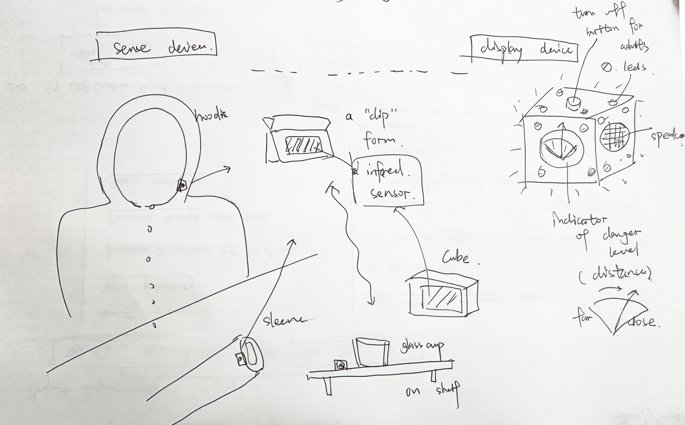
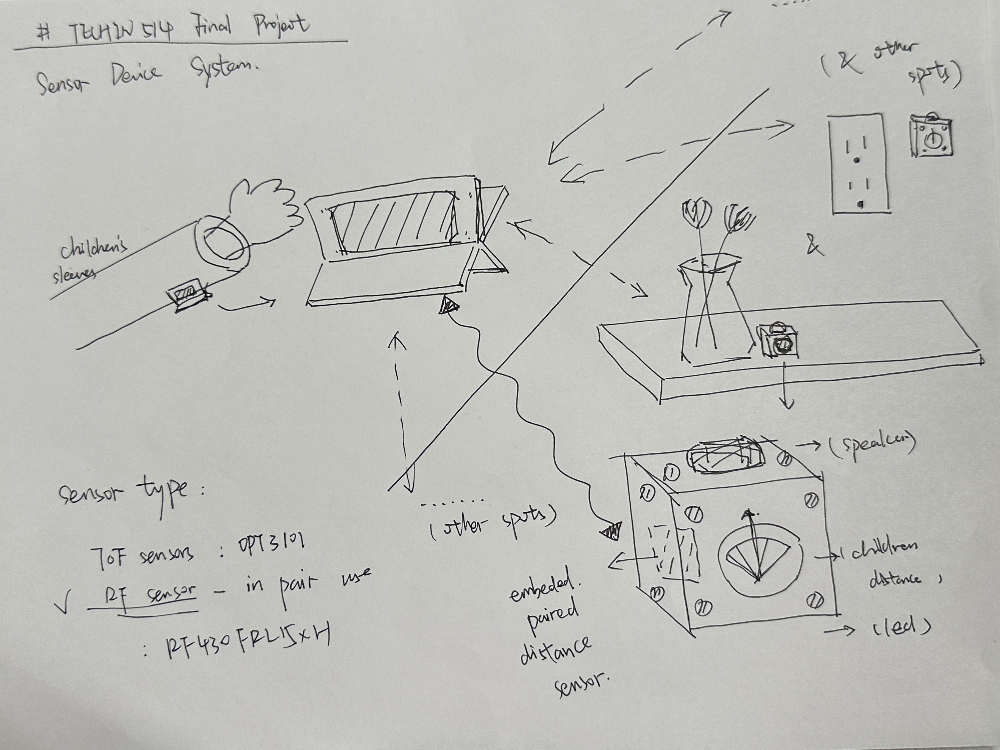
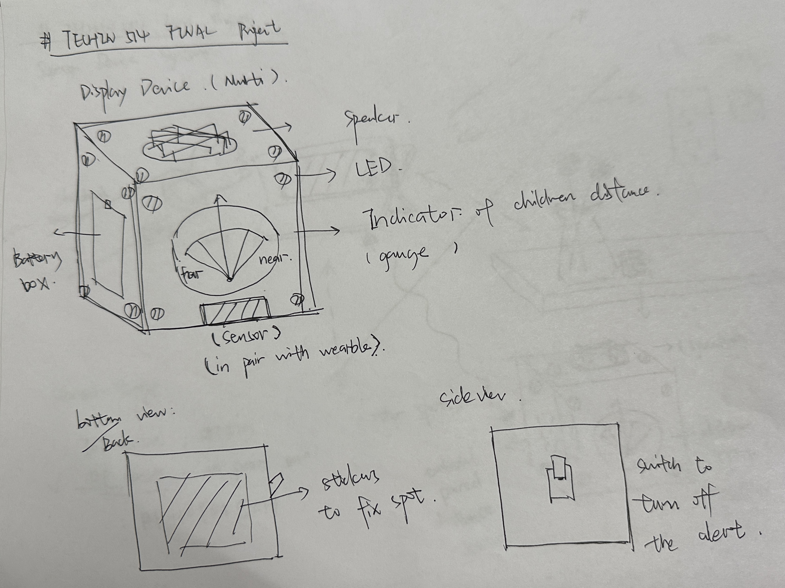
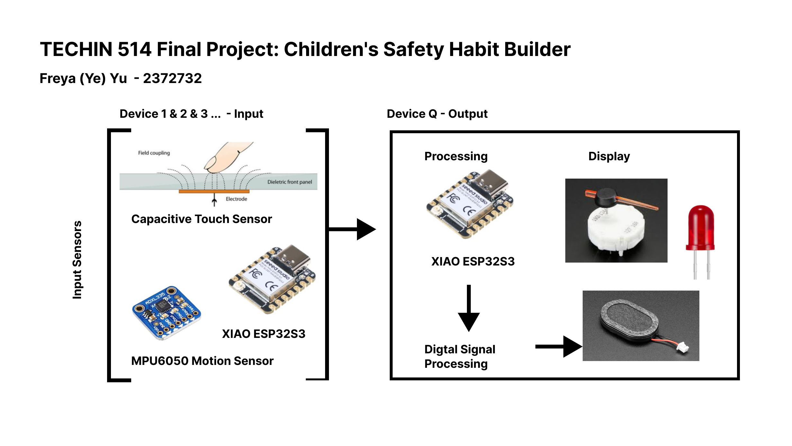

TECHIN 514 Final Project

# Children's Safety Habit Builder

Freya Yu 2372732

## Overview
- The project includes wearable sensors paired with a fixed-spot sensor to detect distance between children's hand and dangerous place, using light and sound to trigger children's discomfort to caltivate children's habit to not touch dangerous places.
- Targeted children age: 1-2 year old

*Above is a general sketch of the project, highlighting the physical features.*

## Sensor Device
The sensor system contains one wearable sensor paired with multiple fixed-spot sensors around home environemnt to detect distance between children's hand and dangerous place.
- Clip form to easy attach to children's clothes
- in pair with the embedded sensor on display device (multiple location)
- possible selections: ToF sensor OPT3101, RF sensor RF430FRL15xH
- processor: XIAO ESP32S3

*Above: Detailed Sensor Device Sketch*

## Display Device
The purpose of display design is to use beeping sound and red led blinking to make children (under 2 years) uncomfortable and quit action
- gauge indicating the extent of danger
- turn off switch button
- warning leds
- embedded speaker
- Battery: Chargeable battery, button or AAA size

*Above: Detailed Display Device Sketch.*

## Communication and Diagram

*System Architetcure Diagram*

